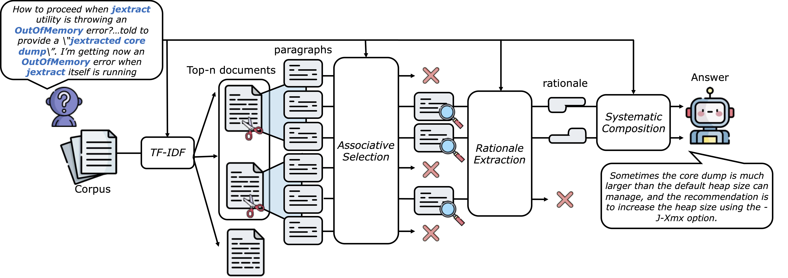

# TIDES: Technical Information Discovery and Extraction System
=======
**TIDES** (Technical Information Distillation and Extraction System) is a training-free, hybrid QA system that combines TF-IDF-based document filtering with prompt-engineered large language models (LLMs) to address technical queries in domain-specific contexts. It achieves high accuracy and efficiency without requiring extensive fine-tuning or retraining of LLMs.



*Figure 1: Overview of the TIDES workflow. The process begins with TF-IDF analysis to identify relevant content in technical documents. Non-relevant documents are discarded, and the remaining documents are segmented into paragraphs. These paragraphs undergo associative selection to further filter out non-relevant content. In the rationale generation phase, key evidence is extracted from the relevant paragraphs. Finally, systematic composition integrates the extracted evidence into a coherent and concise answer to the technical question.*

## Key Features
- **Efficient Document Filtering**: Uses TF-IDF to prioritize domain-specific terms, reducing irrelevant content early in the pipeline.
- **LLM-Enhanced QA**: Employs LLMs like OpenAI's GPT or Together AI's LLaMA for precise rationale generation and systematic answer composition.
- **Multi-Dataset Support**: Works seamlessly with datasets such as TechQA and E-Manual QA.
- **Metrics-Driven Evaluation**: Provides detailed analysis using ROUGE, BERTScore, Precision, Recall, and Token F1 metrics.
- **Zero-Tuning Workflow**: Requires no additional training, leveraging prompt engineering for adaptability.

## System Workflow
1. **TF-IDF Filtering**: Ranks and retains only the most relevant documents for a given query.
2. **Associative Selection**: Segments and identifies paragraphs relevant to the query using tailored prompts.
3. **Rationale Extraction**: Extracts evidence from selected paragraphs while filtering out irrelevant content.
4. **Systematic Composition**: Synthesizes a concise and coherent answer from the extracted evidence.

## Installation
1. Clone the repository:
   ```bash
   git clone https://github.com/username/TIDES.git
   cd TIDES
   ```
2. Install required packages:
   ```bash
   pip install -r requirements.txt
   ```
3. Set up API keys:
   - Create accounts on Together AI and/or OpenAI.
   - Configure your API keys in the environment or configuration files.

## Data Preparation
### TechQA Dataset
- **Source**: [GitHub Repository](https://github.com/IBM/techqa)
- **Paper**: [The TechQA Dataset](https://arxiv.org/abs/1911.02984)
- **Description**: A domain-adaptation question answering dataset for the technical support domain, containing actual user questions from technical forums. 
   ```bash
   python scripts/download_data.py --dataset techqa
   python scripts/preprocess_data.py --dataset techqa
   ```
### E-Manual Corpus
- **Source**: [GitHub Repository](https://github.com/abhi1nandy2/EMNLP-2021-Findings)
- **Paper**: [Question Answering over Electronic Devices: A New Benchmark Dataset and a Multi-Task Learning based QA Framework](https://arxiv.org/abs/2109.05897)
- **Description**: A large corpus of 307,957 electronic manuals used for pre-training models in question answering tasks related to electronic devices. 

**SmartTV Manual Dataset**
   ```bash
   python scripts/download_data.py --dataset smart_tv_remote
   python scripts/preprocess_data.py --dataset smart_tv_remote
   ```

**S10 Manual Dataset**
   ```bash
   python scripts/download_data.py --dataset s10
   python scripts/preprocess_data.py --dataset s10
   ```

## Usage
### Example with Together AI's LLaMA:
   ```bash
   python main.py \
       --dataset techqa \
       --model-type together \
       --model-name meta-llama/Meta-Llama-3.1-8B-Instruct-Turbo \
       --api-key "your-together-api-key" \
       --retriever tfidf
   ```

### Example with OpenAI's GPT:
   ```bash
   python main.py \
       --dataset s10 \
       --model-type openai \
       --model-name gpt-3.5-turbo-0125 \
       --api-key "your-openai-key" \
       --retriever tfidf
   ```

## Directory Structure
```
TIDES/
├── config/               # Configuration files
├── data/                 # Data storage
│   ├── raw/              # Original datasets
│   └── processed/        # Preprocessed data
├── src/                  # Source code
│   ├── utils/            # Utility functions
│   ├── retrieval/        # Retrieval code
│   ├── evaluation/       # Evaluation code
│   └── data/             # Data processing code
├── scripts/              # Helper scripts
└── results/              # Results storage
```

## Key Parameters
- `--dataset`: Dataset to use (`techqa` or `smart_tv_remote` or `s10`)
- `--model-type`: Model service to use (`openai` or `together`)
- `--model-name`: Specific model name
- `--retriever`: Retrieval method (`tfidf`)
- `--batch-size`: Processing batch size
- `--output-dir`: Results directory

## Performance Highlights
TIDES outperforms conventional methods like QASA and Self-RAG by:
- Doubling ROUGE and Token F1 scores in TechQA evaluations.
- Significantly improving runtime efficiency while maintaining high accuracy.

### Ablation Study
TF-IDF achieves the highest document relevance rate (81.81%) compared to BM25, cosine similarity, and Jaccard metrics.

## Evaluation Metrics
- **Precision, Recall, F1 Score**: Measures QA comprehensiveness.
- **ROUGE**: Evaluates n-gram overlap with reference answers.
- **BERTScore**: Assesses semantic similarity.
- **Token F1**: Tracks token-level precision.

## Limitations
- TIDES requires broader validation across more domain-specific datasets.
- Enhancing similarity metrics could further refine relevance filtering.
>>>>>>> source-repo/main
